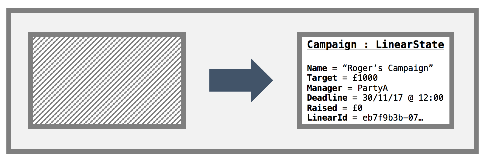
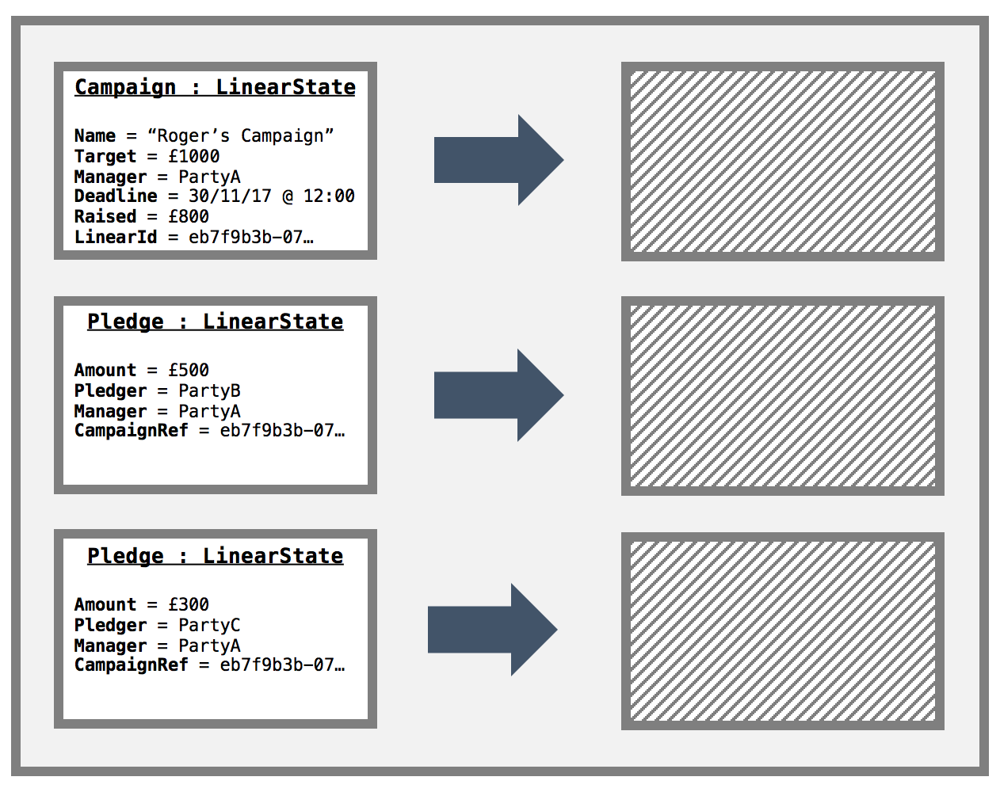

# Crowd Funding Demo

This is a small demo that aims to demonstrate the new observable states feature in Version 2 of Corda. As well as
observable states, it also uses the following features:

* Confidential identities
* Queryable states and custom vault queries
* Schedulable states

## How it works

There are two types of parties:

* Campaign Managers
* Pledgers

As all nodes have the same CorDapp they all have the capability of setting up campaigns and pledging to other campaigns.

1. The demo begins with a node starting a new campaign. The node starting a new campaign becomes the manager for that
   campaign. The manager also needs to specify what the target amount to raise is, along with the campaign deadline and
   a name for the campaign. The manager is the only participant in the `Campaign` state, so it should *only* be stored 
   in the manager node's vault. However, as we use the observable states feature via the `BroadcastTransaction` and
   `RecordTransactionAsObserver` flows, all the other nodes on the network will store this campaign state in their
   vaults too. The create new campaign transaction looks like this:
   
   
   
2. To make a pledge to a campaign, a node user must know the `linearId` of the campaign they wish to pledge to. As all 
   the nodes on the network will receive new `Campaign` states, they can query their vault to enumerate all the 
   campaigns, then pick the one they wish to pledge to. Making a pledge requires a node user to specify the `linearId` 
   of the campaign they wish to pledge to as well as the amount they wish to pledge. The pledging node then constructs a 
   transaction that contains the new `Pledge` state as an output as well as the `Campaign` state to be updated. As such
   there is both a `Campaign` input and output. The transaction looks like this:
   
   
   
   The `CampaignContract` code ensures that `Campaign.raisedSoFar` property is updated in-line with the amount pledged. 
   Note in the above diagram, as this is the only pledge so far in this scenario, the `Campaign` output state reflects 
   the amount in the `Pledge` state.
   
   This as with the create campaign transaction covered above, this transaction is broadcast to all nodes on the 
   network. It is worth noting, that currently, one can only observe a *whole* transaction as opposed to parts of a 
   transaction. This is not necessarily an issue for privacy as the pledgers can create a confidential identity to use
   when pledging, such that it is only known by the pledger and the campaign manager. The main complication with only
   being able to store full transactions manifests itself when querying the vault - all the pledges that you have been
   broadcast, can be returned 
   
3. The `Campaign` is actually a `SchedulableState`. When we create a new campaign, we are required to enter a deadline 
   to which the campaign will run until. Once the deadline is reached, a flow is run to determine whether the campaign
   was a success or failure.
   
   **Success:** The campaign ends successfully if the target amount is reached. In this case, an atomic transaction is 
   produced to exit the `Campaign` state and all the `Pledge` states from the ledger as well as transfer the required
   pledged amounts in cash from the pledgers to the campaign manger.
   
   
   
   **Failure:** The campaign ends in failure if the target is not reached. In this case, an atomic transaction is 
   produced to exit the `Campaign` state and all the `Pledge` states from the ledger. The transaction looks like this:
   
   
   
   As with all the other transactions in this demo, these transactions will be broadcast to all other nodes on the 
   network.

## Assumptions

1. If a node makes a pledge, they will have enough cash to fulfill the pledge when the campaign ends.
2. Confidential pledger identities are adequate from a privacy perspective. We don't mind that 

Welcome to the CorDapp template. The CorDapp template is a stubbed-out CorDapp 
which you can use to bootstrap your own CorDapp projects.

**This is the KOTLIN version of the CorDapp template. For the JAVA version click 
[here](https://github.com/corda/cordapp-template-java/).**

## Pre-Requisites

You will need the following installed on your machine before you can start:

* [JDK 8](http://www.oracle.com/technetwork/java/javase/downloads/jdk8-downloads-2133151.html) 
  installed and available on your path (Minimum version: 1.8_131).
* [IntelliJ IDEA](https://www.jetbrains.com/idea/download/) (Minimum version 2017.1)
* git
* Optional: [h2 web console](http://www.h2database.com/html/download.html)
  (download the "platform-independent zip")

For more detailed information, see the
[getting set up](https://docs.corda.net/getting-set-up.html) page on the
Corda docsite.

## Getting Set Up

To get started, clone this repository with:

     git clone https://github.com/corda/cordapp-template-kotlin.git

And change directories to the newly cloned repo:

     cd cordapp-template-kotlin

## Building the CorDapp template:

**Unix:** 

     ./gradlew deployNodes

**Windows:**

     gradlew.bat deployNodes

Note: You'll need to re-run this build step after making any changes to
the template for these to take effect on the node.

## Running the Nodes

Once the build finishes, change directories to the folder where the newly
built nodes are located:

     cd build/nodes

The Gradle build script will have created a folder for each node. You'll
see three folders, one for each node and a `runnodes` script. You can
run the nodes with:

**Unix:**

     ./runnodes --log-to-console --logging-level=DEBUG

**Windows:**

    runnodes.bat --log-to-console --logging-level=DEBUG

You should now have three Corda nodes running on your machine serving 
the template.

When the nodes have booted up, you should see a message like the following 
in the console: 

     Node started up and registered in 5.007 sec

## Interacting with the CorDapp via HTTP

The CorDapp defines a couple of HTTP API end-points and also serves some
static web content. Initially, these return generic template responses.

The nodes can be found using the following port numbers, defined in 
`build.gradle`, as well as the `node.conf` file for each node found
under `build/nodes/partyX`:

     PartyA: localhost:10007
     PartyB: localhost:10010

As the nodes start up, they should tell you which host and port their
embedded web server is running on. The API endpoints served are:

     /api/template/templateGetEndpoint

And the static web content is served from:

     /web/template

## Using the Example RPC Client

The `ExampleClient.kt` file is a simple utility which uses the client
RPC library to connect to a node and log its transaction activity.
It will log any existing states and listen for any future states. To build 
the client use the following Gradle task:

     ./gradlew runTemplateClient

To run the client:

**Via IntelliJ:**

Select the 'Run Template RPC Client'
run configuration which, by default, connect to PartyA (RPC port 10006). Click the
Green Arrow to run the client.

**Via the command line:**

Run the following Gradle task:

     ./gradlew runTemplateClient
     
Note that the template rPC client won't output anything to the console as no state 
objects are contained in either PartyA's or PartyB's vault.

## Running the Nodes Across Multiple Machines

The nodes can also be set up to communicate between separate machines on the 
same subnet.

After deploying the nodes, navigate to the build folder (`build/
nodes`) and move some of the individual node folders to 
separate machines on the same subnet (e.g. using a USB key). It is important 
that no nodes - including the controller node - end up on more than one 
machine. Each computer should also have a copy of `runnodes` and 
`runnodes.bat`.

For example, you may end up with the following layout:

* Machine 1: `controller`, `partya`, `runnodes`, `runnodes.bat`
* Machine 2: `partyb`, `partyc`, `runnodes`, `runnodes.bat`

You must now edit the configuration file for each node, including the 
controller. Open each node's config file (`[nodeName]/node.conf`), and make 
the following changes:

* Change the artemis address to the machine's ip address (e.g. 
  `artemisAddress="10.18.0.166:10005"`)
* Change the network map address to the ip address of the machine where the 
  controller node is running (e.g. `networkMapAddress="10.18.0.166:10002"`) 
  (please note that the controller will not have a network map address)

Each machine should now run its nodes using `runnodes` or `runnodes.bat` 
files. Once they are up and running, the nodes should be able to communicate 
among themselves in the same way as when they were running on the same machine.

## Further reading

Tutorials and developer docs for CorDapps and Corda are
[here](https://docs.corda.net/).